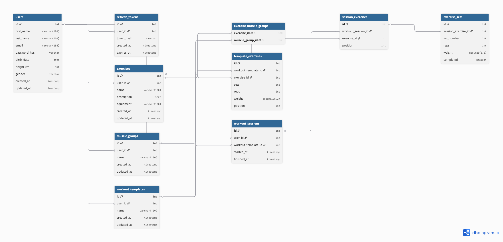

# Fitness Tracker REST API

## Overview

A fitness tracker REST API, allowing users to log workouts, manage exercises, track progress, and create reusable workout templates.

---

## Table of Contents


---

## Architecture

### Back-End Framework
- Built with **JavaScript** and **Express.js**
- Uses Express's middleware and routing functionality for modular routes/middleware/error-handling

### Data Management
- **PostgreSQL:** Database Management System
- **Prisma:** Database configuration and Schema management 
- **Prisma CLient:** Object-Relational Mapping

### Authentication/Authorization
- **JSON Web Tokens:** 
  - Short-lived access tokens for secure request authentication
  - Longer-lived, hashed reresh tokens temporarily stored in databse for secure persistent login
- **Bcrypt:** Password and refresh-token hashing
- Authorization system, permitting only allowed users to access and modify resources

### Validation
- **Express-validator:**
  - Request validation and sanitisation
  - Clear error responses for invalid requests

### Testing
- **Jest:** Testing framework
- **Supertest:** Simulate HTTP requests to facilitate integration testing

### Environment
- .env file required for managing environment variables
- **Dotenv:** Secure injection of environment variables at runtime

### Misc
- **Prettier:** Code formatting

---

## Project Structure

```text
  .
  ├── .env
  ├── .git/
  ├── .gitignore
  ├── generated
  │   └── prisma/
  ├── node_modules/
  ├── package-lock.json
  ├── package.json
  ├── prisma
  │   ├── migrations/
  │   ├── prisma.js
  │   └── schema.prisma
  ├── README.md
  ├── src
  │   ├── app.js
  │   ├── controllers
  │   │   ├── auth.js
  │   │   ├── exercises.js
  │   │   ├── muscleGroups.js
  │   │   ├── users.js
  │   │   ├── workoutSessions.js
  │   │   └── workoutTemplates.js
  │   ├── middleware
  │   │   ├── asyncErrorHandler.js
  │   │   ├── authenticate.js
  │   │   ├── authorize.js
  │   │   ├── errorHandler.js
  │   │   └── validate.js
  │   ├── routes
  │   │   ├── auth.js
  │   │   ├── exercises.js
  │   │   ├── muscleGroups.js
  │   │   ├── users.js
  │   │   ├── workoutSessions.js
  │   │   └── workoutTemplates.js
  │   ├── server.js
  │   └── validators
  │       ├── auth.js
  │       ├── common.js
  │       ├── exercises.js
  │       ├── muscleGroups.js
  │       ├── users.js
  │       ├── workoutSessions.js
  │       └── workoutTemplates.js
  ├── tests
  │   ├── helpers
  │   │   └── jwt.js
  │   └── integration
  │       ├── auth.test.js
  │       ├── exercises.test.js
  │       ├── muscleGroups.test.js
  │       ├── users.test.js
  │       ├── workoutSessions.test.js
  │       └── workoutTemplates.test.js
  └── TODO.md
```

---

## API Routes

### Auth
- `POST /auth/login` — Authenticate credentials and generate tokens
- `POST /auth/logout` — Invalidate refresh token
- `POST /auth/refresh-token` — Refresh access token

### Users
- `POST /users` - Create a new user
- `GET /users/:userId` - Get user details by ID
- `PATCH /users/:userId` - Update user details by ID
- `DELETE /users/:userId` - Remove a user

### Exercises
- `GET /exercises` — List all exercises for client user
- `POST /exercises` — Create a new exercise for client user
- `GET /exercises/:exerciseId` — Get an exercise's data by ID
- `PATCH /exercises/:exerciseId` — Update exercise
- `DELETE /exercises/:exerciseId` — Delete exercise

### Muscle Groups
- `GET /muscle-groups` — List all muscle groups for client user
- `POST /muscle-groups` — Create a new muscle group for client user
- `GET /muscle-groups/:muscleGroupId` — Get an muscle group's data by ID
- `PATCH /muscle-groups/:muscleGroupId` — Update muscle group
- `DELETE /muscle-groups/:muscleGroupId` — Delete muscle group

### Workout Templates
- `GET /workout-templates` — List templates for client user
- `POST /workout-templates` — Create new template for client user
- `GET /workout-templates/:workoutTemplateId` — Get template details with nested exercises
- `PATCH /workout-templates/:workoutTemplateId` — Update template
- `DELETE /workout-templates/:workoutTemplateId` — Delete template

### Workout Sessions
- `GET /workout-sessions` — List workout sessions for client user
- `POST /workout-sessions` — Create new session for client user
- `GET /workout-sessions/:workoutSessionId` — Get session with nested exercises & sets
- `PATCH /workout-sessions/:workoutSessionId` — Update session
- `DELETE /workout-sessions/:workoutSessionId` — Delete session

---

## Database Schema


---